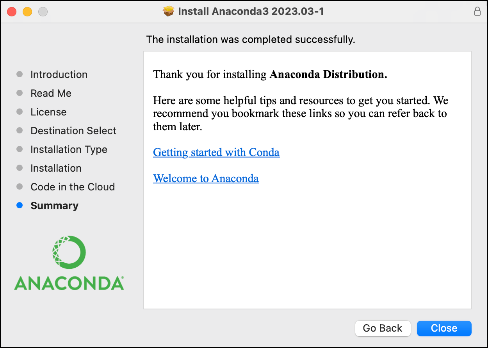

# Installing Anaconda3 on macOS

This guide provides step-by-step instructions on how to install Anaconda3 on a macOS system. Anaconda is a popular distribution of Python programming languages for scientific computing.

## Reference
- https://docs.continuum.io/anaconda/install/mac-os/
- https://docs.continuum.io/anaconda/install/verify-install/

## Step 1: Download the Anaconda Installer

1. Go to the Anaconda distribution page: [Anaconda Installers](https://www.anaconda.com/download/success)
2. Select the macOS version.
3. Make sure you select the right version for your CPU (Apple silicon or Intel chips)
4. Download the graphical installer.

## Step 2: Run the Installer

1. Once the download is complete, locate the downloaded file in your `Downloads` folder. The file should be named something like `Anaconda3-2024.06-1-MacOSX-arm64.pkg`.
2. Double-click the `.pkg` file to launch the installer.
3. Follow the on-screen instructions:
   - Click "Continue".
   - Review the software license agreement and click "Continue", then click "Agree" to accept.
   - Select an install location (it's recommended to use the default location).
   - Click "Install" to start the installation process.
   - Enter your administrator password if prompted and click "Install Software".
   - A successful installation displays the following screen:
    

## Step 3: Verify Installation

To verify that Anaconda was installed correctly, you can use the terminal:

1. Open the Terminal application (you can find it in the `Applications/Utilities` folder or search for it using Spotlight).
2. You should see (base) in the command line prompt. This tells you that you’re in your base conda environment.
3. Type `conda list`. This command lists all the packages installed in the Anaconda environment. If Anaconda is installed correctly, you should see a list of installed packages.

## Step 4: Deactivate the base environment by default

1. In Terminal, use the following line to prevent Anaconda from activating the base environment on startup

```bash
conda config --set auto_activate_base false
```
2. restart the Terminal, (base) in the command line prompt should gone.

