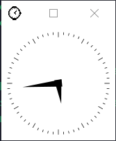

# Install Termius and Enable X-server for Remote Display (Windows)

Termius is a popular SSH client that allows users to securely access and manage remote servers. It’s available on multiple platforms including Windows, macOS, Linux, iOS, and Android. Here’s a step-by-step guide on how to install Termius and enable X-server for remote display on Windows.

## Installing Termius on Windows

1. **Download Termius:**
   - Visit the [Termius official website](https://termius.com/) and click on the **Download** button.
   - Choose the **Windows** version to download the `.exe` installer file.

2. **Run the Installer:**
   - Locate the downloaded `.exe` file in your downloads folder and double-click it to run the installer.

3. **Install Termius:**
   - Follow the on-screen instructions to install Termius. You may need to accept the license agreement and choose an installation location.

4. **Launch Termius:**
   - After the installation is complete, you can launch Termius from the Start menu or by searching for it in the search bar.

## Setting Up Termius

After installing Termius, you will need to set it up:

1. **Create an Account or Log In:**
   - When you first launch Termius, you will be prompted to create an account or log in. You can use your email, Google, or GitHub account.

2. **Add a Host:**
   - To connect to a server, click the **New Host** button. Enter the host details such as hostname, host address, username, and password.
   
   - Then the host will be saved in your Termius client for future reference.

3. **Connect to Your Host:**
   - Click on the host you just created to start an SSH session.

## Installing X-server on Windows

1. **Download X410:**
   - Visit the [X410 official website](https://x410.dev/) and click on the **Download** button.
   - Choose the **x64** version to download the `.exe` installer file.

2. **Run the Installer:**
   - Locate the downloaded `.exe` file in your downloads folder and double-click it to run the installer.

3. **Install X410:**
   - Follow the on-screen instructions to install X410. You may need to accept the license agreement and choose an installation location.

4. **Launch X410:**
   - After the installation is complete, you can launch X410 from the Start menu or by searching for it in the search bar.

## Enable Remote Display

1. **Ensure X410 is Running:**

   
   
   You can always use the trial version for educational purposes. It is no different from the paid version, except for the trial version reminder.

2. **Create a Port Forwarding Rule:**
   - In Termius, go to the `Port Forwarding` section and create a new remote port forwarding.
    

   - Select the remote host you want to connect to. The remote port number is `6000 + x` (where `x` is `857` in this example), and the bind and destination addresses are both `127.0.0.1`. The destination port number is set to `6000`.
    

   - Double-click the rule. If it turns blue, it means the port forwarding was successful.
    

   - **!!! You need to start the port forwarding before using remote display**.

3. **Define the `DISPLAY` Environment Variable on Your Remote Host:**
   - Edit your `.bashrc` file:
     ```bash
     nano ~/.bashrc
     ```

   - Add the following lines at the end of your `.bashrc` file:
     ```bash
     # Remote Display
     export DISPLAY="127.0.0.1:x.0"
     ```
     Replace `x` with the value you selected, which is `857` in this example.

4. **Test the Remote Display:**
   - Use the `xclock` command to test the remote display. A small clock should appear on your screen.

     
